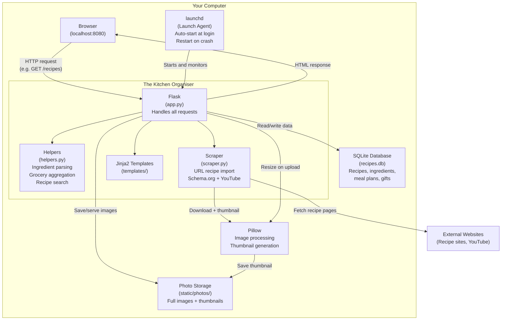
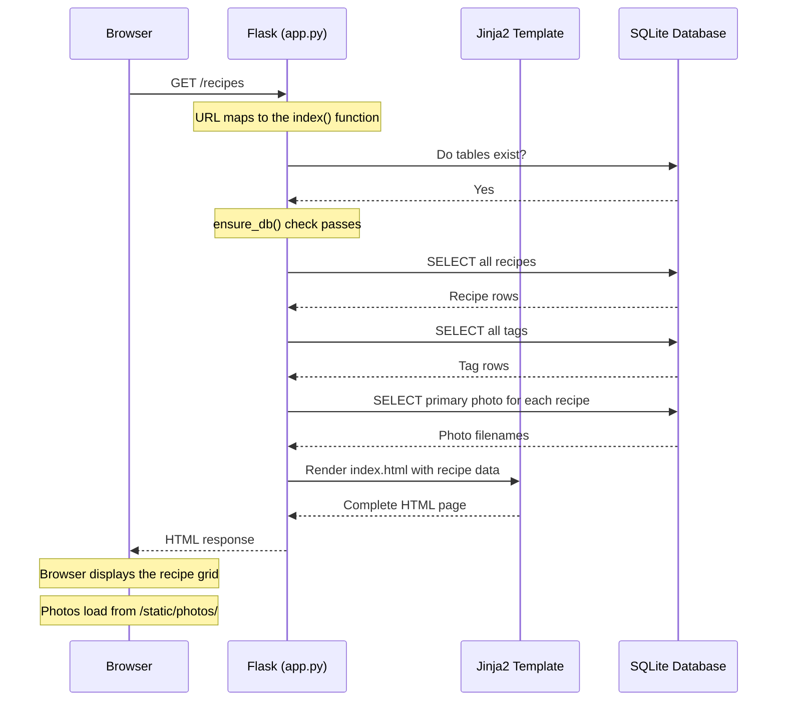

# Architecture Decisions

This document explains the key technical choices behind The Kitchen Organiser — what was chosen, why, what alternatives were considered, and what trade-offs were accepted.

---

## System Overview

How the main components of the app connect together. The browser talks to Flask, Flask talks to the database and file system, and launchd keeps everything running.



---

## Database Schema

How the 14 tables in the database relate to each other. Arrows show foreign key relationships — for example, each ingredient belongs to one recipe, and each recipe can have many ingredients.

```mermaid
erDiagram
    recipe {
        int id PK
        text title
        text description
        int prep_time
        int cook_time
        int servings
        text source
        text steps "JSON array"
    }

    ingredient {
        int id PK
        int recipe_id FK
        text name
        real quantity
        text unit
        text grocery_category
        int sort_order
    }

    photo {
        int id PK
        int recipe_id FK
        text filename
        text caption
        int is_primary
    }

    note {
        int id PK
        int recipe_id FK
        text content
    }

    tag {
        int id PK
        text name
    }

    recipe_tag {
        int recipe_id FK
        int tag_id FK
    }

    meal_plan {
        int id PK
        text name
        text plan_type "weekly or event"
        text event_date
        text event_time
    }

    meal_plan_item {
        int id PK
        int meal_plan_id FK
        int recipe_id FK "optional"
        text free_text "optional"
        text slot_label "e.g. Monday Dinner"
        int servings_override
    }

    meal_plan_day_note {
        int id PK
        int meal_plan_id FK
        text day
        text content
    }

    event_note {
        int id PK
        int meal_plan_id FK
        text content
    }

    event_photo {
        int id PK
        int meal_plan_id FK
        text filename
    }

    event_invitee {
        int id PK
        int meal_plan_id FK
        text name
        text rsvp "pending, attending, not attending"
        text dietary
    }

    gift_hamper {
        int id PK
        text title
        text gift_date
    }

    gift_hamper_item {
        int id PK
        int hamper_id FK
        text description
        int checked
        text note
    }

    gift_photo {
        int id PK
        int hamper_id FK
        text filename
    }

    recipe ||--o{ ingredient : "has"
    recipe ||--o{ photo : "has"
    recipe ||--o{ note : "has"
    recipe ||--o{ recipe_tag : "tagged with"
    tag ||--o{ recipe_tag : "applied to"
    recipe ||--o{ meal_plan_item : "used in"
    meal_plan ||--o{ meal_plan_item : "contains"
    meal_plan ||--o{ meal_plan_day_note : "has"
    meal_plan ||--o{ event_note : "has"
    meal_plan ||--o{ event_photo : "has"
    meal_plan ||--o{ event_invitee : "has"
    gift_hamper ||--o{ gift_hamper_item : "contains"
    gift_hamper ||--o{ gift_photo : "has"
```



---

## Request Flow

What happens step by step when you visit a page — from typing the URL to seeing the result. This example shows loading the recipe list page.



---

## Detailed Decisions

---

## 1. Flask as the Web Framework

**What it is:** Flask is a lightweight Python web framework. It handles incoming web requests (like when you visit a page) and sends back HTML responses.

**Why Flask?**
This is a single-user app that runs on your own computer. Flask is minimal — it gives you routing (mapping URLs to functions) and templating (generating HTML) without imposing a project structure or bundling features you don't need.

**What was considered:**
- **Django** — a full-featured framework with an admin panel, ORM, and authentication built in. This would be the right choice for a multi-user web app deployed to a server, but it's overkill here. Django's ORM, admin interface, and user management system would all go unused.
- **FastAPI** — designed for building JSON APIs, not serving HTML pages. Would have been a good fit if the app had a separate frontend (e.g. a React app), but adds unnecessary complexity for server-rendered HTML.

**Trade-off accepted:** Flask doesn't enforce any project structure, so as the app grows, it's up to the developer to keep things organised. For a larger team or project, Django's structure would help maintain consistency.

---

## 2. SQLite as the Database

**What it is:** SQLite is a database engine that stores everything in a single file on your computer. There's no separate database server to install or run.

**Why SQLite?**
- Zero configuration — no server, no passwords, no ports
- The database is a single file (`recipes.db`), which makes backups trivial (just copy the file)
- Python includes SQLite support out of the box — no extra packages needed
- More than capable for a single-user app — SQLite can handle millions of rows

**What was considered:**
- **PostgreSQL** — a powerful, production-grade database server. Ideal for multi-user web apps, but requires installation, configuration, running a separate service, and managing credentials. Completely unnecessary for a personal app.
- **JSON files** — storing data as flat JSON files would be simpler initially, but quickly becomes painful when you need to query across recipes (e.g. "find all recipes with chicken"), manage relationships (recipes ↔ ingredients ↔ tags), or ensure data integrity.

**Trade-off accepted:** SQLite doesn't support concurrent writes from multiple users. This is irrelevant for a single-user app, but would need to change if the app were deployed as a shared web service.

---

## 3. HTMX for Frontend Interactivity

**What it is:** HTMX is a small JavaScript library that lets you make web pages interactive using HTML attributes instead of writing JavaScript code. For example, you can make a button submit a form and update part of the page without a full reload — just by adding attributes to the HTML.

**Why HTMX?**
The app needs interactive features like click-to-edit fields, inline form submissions, and deleting items without refreshing the page. HTMX provides all of this with zero custom JavaScript.

For example, a delete button looks like this:
```html
<button hx-post="/note/5/delete" hx-target="closest .note" hx-swap="outerHTML">
    Delete
</button>
```

No JavaScript files, no event listeners, no fetch calls.

**What was considered:**
- **React/Vue/Svelte** — these are full JavaScript frameworks for building single-page applications (SPAs). They require a build pipeline (Node.js, npm, webpack/vite), a separate API layer, state management, and significantly more code. For an app that primarily displays content with occasional interactivity, this is a heavy price to pay.
- **Vanilla JavaScript** — writing all the interactivity by hand. This works but leads to repetitive fetch/DOM manipulation code for every interactive element. HTMX eliminates this boilerplate.
- **No interactivity (full page reloads)** — the simplest option, but the user experience suffers. Deleting a note shouldn't require reloading the entire recipe page.

**Trade-off accepted:** HTMX is less flexible than a full JavaScript framework. Complex client-side features (e.g. drag-and-drop meal plan reordering, real-time search-as-you-type) would be harder to build. For this app's needs, that limitation hasn't been reached.

---

## 4. Server-Side HTML Rendering (Jinja2 Templates)

**What it is:** When you visit a page, the server builds the complete HTML and sends it to your browser. This is the traditional way the web works — as opposed to modern SPAs where the server sends raw data and the browser builds the page using JavaScript.

**Why server-side rendering?**
- Simpler architecture — one codebase, one language (Python), no build tools
- Pages work immediately in any browser, even with JavaScript disabled
- Easier to reason about — each URL maps to a function that returns a page
- Combined with HTMX, you get the interactivity benefits of an SPA without the complexity

**What was considered:**
- **SPA with a JSON API** — the server would return only data, and a JavaScript frontend would build the pages. This is common in modern web development but requires maintaining two separate codebases (backend API + frontend app), introduces client-side routing and state management, and doubles the surface area for bugs.

**Trade-off accepted:** Server-rendered pages make a full round trip to the server for every interaction. On a local network (localhost), this latency is imperceptible. On a slow remote connection, an SPA would feel more responsive.

---

## 5. Template Pre-loading at Startup

**What it is:** When the app starts, it reads and compiles every HTML template into memory before serving any requests. Normally Flask loads templates on demand (the first time each page is visited).

**Why pre-load?**
After macOS goes to sleep and wakes up, file system operations can temporarily deadlock — the operating system hasn't fully restored disk access yet. If Flask tries to read a template file during this window, the request hangs indefinitely. By loading everything at startup, templates are served from memory and the app never needs to read template files during normal operation.

The app also retries up to 5 times with a 1-second delay if a template fails to load during startup, handling cases where the app restarts immediately after a wake event.

**What was considered:**
- **Ignoring the problem** — works fine on Linux/cloud servers, but this is a macOS desktop app that sleeps and wakes frequently.
- **Disabling sleep** — not a reasonable ask for a personal laptop.
- **Watchdog/file monitoring** — more complex, and doesn't solve the root cause.

**Trade-off accepted:** Startup takes slightly longer (a fraction of a second), and template changes require restarting the app. Since this is a production app (not under active template editing), that's acceptable.

---

## 6. Ingredient Parsing with Pattern Matching

**What it is:** When you type ingredients in free text (e.g. "2 cups flour" or "1/2 tsp salt"), the app parses this into structured data — a quantity (2), a unit (cups), and a name (flour). This is done using regular expressions and a lookup table of known units.

**Why pattern matching?**
Ingredient lines follow predictable patterns: an optional number, an optional unit, and a name. A regex plus a unit lookup table handles the vast majority of real-world ingredient formats, including:
- Whole numbers: "2 cups flour"
- Fractions: "1/2 tsp salt"
- Unicode fractions: "½ cup butter"
- Mixed numbers: "1 1/2 tbsp oil"
- No quantity: "salt and pepper to taste"

**What was considered:**
- **Natural language processing (NLP)** — libraries like spaCy could parse ingredient text more flexibly, but add a large dependency (~500MB) for marginal improvement. The structured patterns of ingredient text don't need the full power of NLP.
- **Requiring structured input** — making the user fill in separate fields for quantity, unit, and name. This is more reliable but slower to use — typing "2 cups flour" is much faster than filling in three fields.

**Trade-off accepted:** The parser can't handle every possible format. Unusual phrasings like "a handful of basil" or "juice of 2 lemons" may not parse perfectly. In practice, the most common formats are covered.

---

## 7. Grocery Category Auto-Detection

**What it is:** When generating a grocery list, each ingredient is automatically sorted into a category (Produce, Meat, Dairy, Pantry, etc.) using a lookup table of 80+ common ingredients.

**Why a lookup table?**
It's fast, predictable, and easy to extend. Looking up "chicken" → "meat" in a dictionary is instant and always gives the same result.

**What was considered:**
- **Machine learning classification** — could handle unknown ingredients more gracefully, but adds significant complexity and dependencies for a problem that a simple dictionary solves well.
- **User-defined categories** — letting users manually categorise each ingredient. This gives more control but adds friction to every recipe entry.

**Trade-off accepted:** Unknown ingredients default to "Other". The lookup table needs manual expansion to cover new ingredients, but this is a quick edit to a dictionary in `helpers.py`.

---

## 8. Photo Thumbnails Generated on Upload

**What it is:** When you upload a recipe photo, the app immediately creates a smaller version (400x400 pixels) called a thumbnail. The thumbnail is used on listing pages and grid views; the full-size image is used on detail pages.

**Why generate on upload?**
A phone photo can be 4-8MB. If the recipe grid loaded full-size images for 20+ recipes, the page would be slow — downloading 100MB+ of images just to show small previews. Generating a thumbnail once on upload means every subsequent page load is fast.

**What was considered:**
- **Client-side resizing** — the browser can resize images with CSS, but it still downloads the full-size file. This wastes bandwidth and memory.
- **On-demand resizing** — generate thumbnails when requested rather than on upload. This avoids storing two files but adds processing time to every page load. For a local app, disk space is cheap; latency is not.
- **Cloud image service** — services like Cloudinary or imgix handle resizing at the CDN level. Ideal for production web apps, but overkill for a local app and introduces an external dependency.

**Trade-off accepted:** Each photo is stored twice (full + thumbnail), using more disk space. For typical recipe photos, the thumbnail is ~50KB vs ~4MB for the original — the trade-off is overwhelmingly worthwhile.

---

## 9. launchd for Process Management

**What it is:** launchd is macOS's built-in system for running background services. A Launch Agent (a configuration file) tells macOS to start the app at login and restart it if it crashes.

**Why launchd?**
It's the native macOS solution — no additional software to install, reliable, and managed by the operating system itself. The configuration is a single XML file.

**What was considered:**
- **Docker** — a containerisation platform that packages the app with all its dependencies. Standard for server deployments, but on a personal Mac it means running a Linux VM, managing container images, and adding 2GB+ of overhead. The app already runs natively on macOS.
- **Homebrew services** — uses launchd under the hood but requires Homebrew and a formulae. Adds a dependency without adding value.
- **Manual start** — just running `python app.py` in a terminal. Works but requires remembering to start it, keeping a terminal window open, and manually restarting after crashes or reboots.

**Trade-off accepted:** launchd is macOS-only. If the app were ported to Linux, systemd would be the equivalent. The plist configuration format (XML) is verbose, but it's written once and rarely changed.

---

## 10. Recipe URL Import via Schema.org and YouTube Scraping

**What it is:** When creating a new recipe, you can paste a URL from a recipe website or YouTube video. The app fetches the page, extracts the recipe data, and pre-fills the form for review before saving.

**Why Schema.org JSON-LD?**
Most major recipe websites (RecipeTinEats, AllRecipes, BBC Good Food, Serious Eats, etc.) embed structured recipe data using the Schema.org `Recipe` type in JSON-LD format. This is the same data Google uses to display rich recipe cards in search results, so it's reliably present and well-maintained. Parsing this structured data is far more reliable than scraping HTML elements, which vary across sites.

**Why YouTube description parsing?**
Many recipe YouTubers include the full recipe in the video description. Extracting this text and splitting on common headers ("Ingredients", "Instructions") is a simple heuristic that avoids the complexity and cost of video transcription or AI-based extraction.

**What was considered:**
- **Dedicated recipe scraping library (`recipe-scrapers`)** — a Python library with site-specific parsers for 100+ recipe sites. More robust for edge cases, but adds a heavyweight dependency with frequent updates needed as sites change. Schema.org JSON-LD provides a single, standards-based approach that works across sites without site-specific code.
- **AI/LLM-based extraction** — could handle unstructured pages more flexibly, but adds an external API dependency, cost, and latency. Unnecessary when the structured data is already there.
- **Video transcription (Whisper)** — would enable importing from videos without recipe descriptions, but adds a large dependency (~1GB model) for a niche use case.

**Trade-off accepted:** Sites without Schema.org markup won't work, and YouTube videos without recipes in the description will only import the title and thumbnail. In practice, the vast majority of recipe content falls into the supported formats.

---

## 11. Single-File Application Structure

**What it is:** All 57 route handlers live in a single file (`app.py`), with helper functions separated into `helpers.py`.

**Why a single file?**
At ~1200 lines, the app is large enough to benefit from clear section comments but not so large that it needs to be split into multiple modules. Flask doesn't require a specific project structure, and keeping everything in one file means you can search the entire application logic with Ctrl+F.

**What was considered:**
- **Flask Blueprints** — Flask's mechanism for splitting routes across multiple files (e.g. `recipes.py`, `meal_plans.py`, `gifts.py`). This would be the right move if the app grew significantly or if multiple developers were working on different features simultaneously.

**Trade-off accepted:** A single file becomes harder to navigate as it grows. If the app doubled in size, splitting into Blueprints would be worthwhile. At the current size, the simplicity of one file outweighs the organisational benefits of multiple files.

---

## What Would Change at Scale

If The Kitchen Organiser were deployed as a multi-user web service, several decisions would change:

| Current Choice | At Scale |
|---------------|----------|
| SQLite | PostgreSQL — concurrent users need concurrent writes |
| launchd | Docker + container orchestration (e.g. Kubernetes) |
| File-based photos | Cloud storage (S3) + CDN for image delivery |
| Single file | Flask Blueprints or a migration to Django |
| Local-only | Authentication, user accounts, HTTPS |
| Server-rendered HTML | Potentially an SPA for richer real-time interactions |
| In-process sessions | Redis or database-backed sessions |

These are intentional decisions for a personal tool, not oversights. The architecture fits the current requirements and could evolve if the scope changed.
