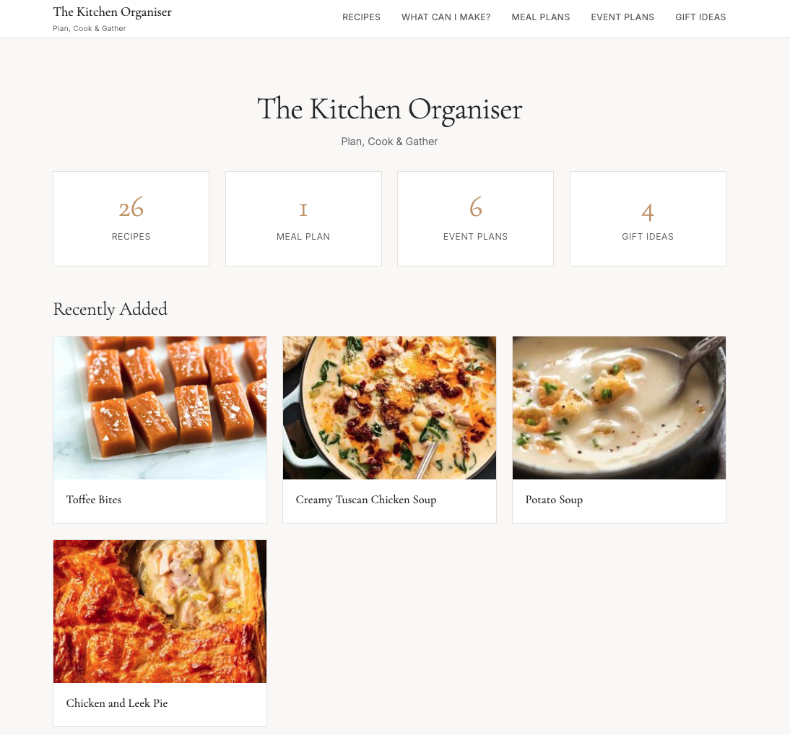
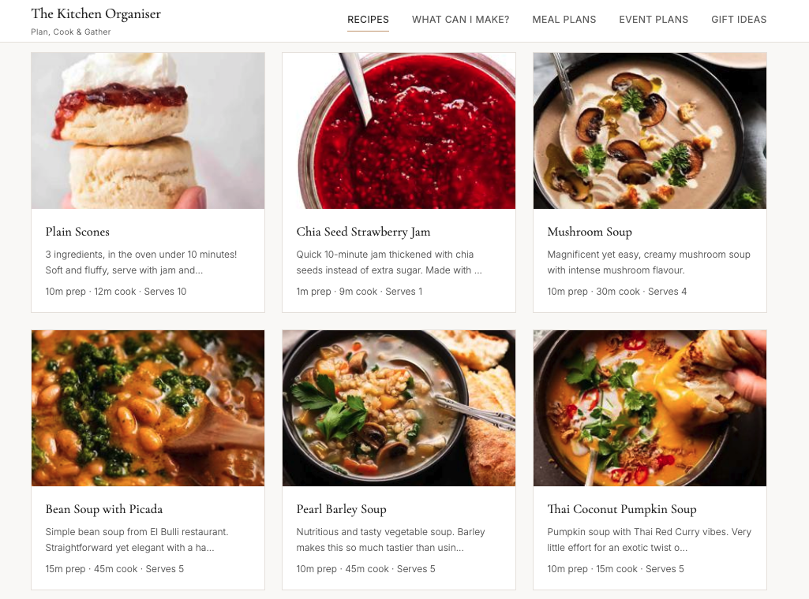
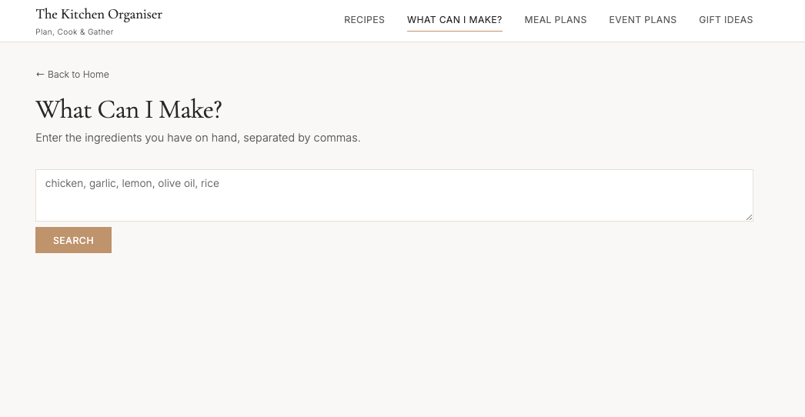
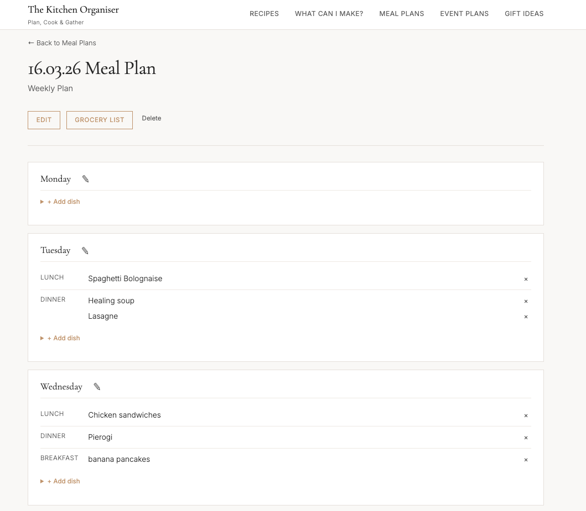
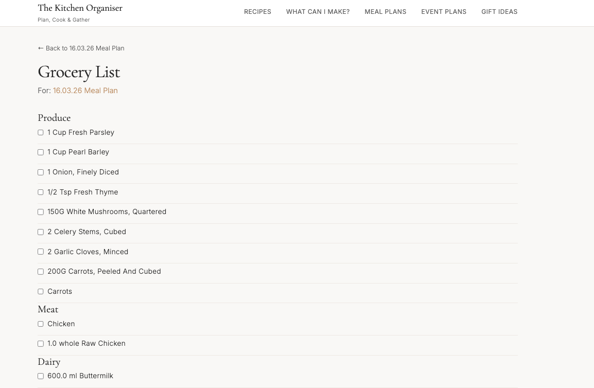
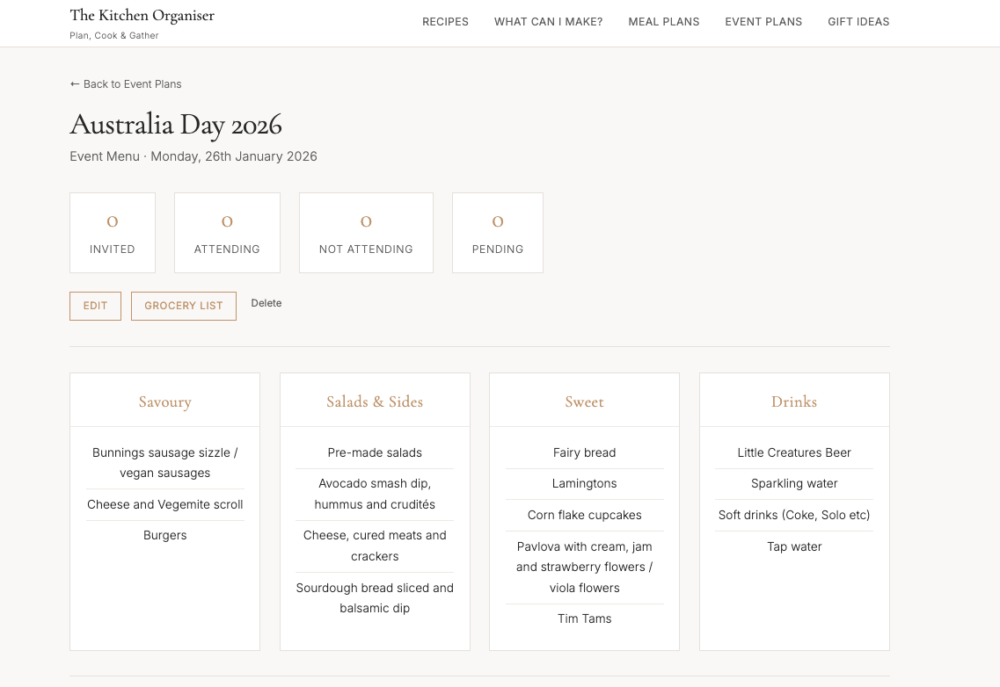
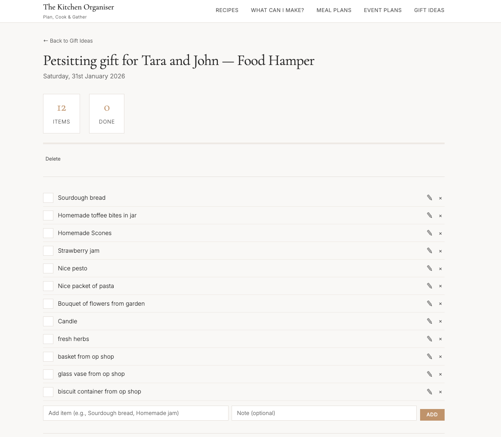

# The Kitchen Organiser

> A local-first web app for meal planning, recipe management, grocery lists, event hosting, and gift tracking — all in one place.




## Features

**Recipe Management**
- Create, edit, and delete recipes with ingredients, steps, photos, and notes
- Upload multiple photos per recipe with automatic thumbnail generation
- Tag-based organisation and full-text search
- "What Can I Make?" — search by ingredients you have on hand, ranked by match percentage



**Ingredient Search**
- Enter the ingredients you have on hand and find matching recipes
- Results ranked by match percentage so you can see the best options first



**Meal Planning**
- Weekly meal plans with a flexible day-by-day slot system (e.g. Monday Breakfast, Tuesday Dinner)
- Link recipes or add free-text items to any meal slot
- Per-meal serving overrides
- Day-specific notes (e.g. "John is joining for dinner")



**Grocery Lists**
- Auto-generated from meal plan recipes
- Smart aggregation — combines duplicate ingredients across recipes, respects units and serving sizes
- Organised by grocery aisle category (Produce, Meat, Dairy, Pantry, etc.)
- Printable layout



**Event Planning**
- Event-based plans with guest management and RSVP tracking
- Dietary notes per guest
- Menu organised by category (Savoury, Salads & Sides, Sweet, Drinks)
- Event photos and notes



**Gift Tracking**
- Gift hampers with item checklists and progress tracking
- Inspiration photo uploads
- Upcoming and past gift views



## Tech Stack

| Layer     | Technology | Why |
|-----------|-----------|-----|
| Backend   | **Flask 3.1** (Python 3.12) | Lightweight and well-suited for a local-first app without the overhead of a full framework like Django |
| Database  | **SQLite** | Zero-configuration, file-based — perfect for a single-user local app with no need for a database server |
| Frontend  | **HTMX 2.0** | Adds dynamic behaviour (click-to-edit, inline forms) without writing a JavaScript framework or SPA |
| Styling   | **Vanilla CSS** with CSS custom properties | Full control over the design system without build tools or CSS framework dependencies |
| Images    | **Pillow** | Server-side thumbnail generation to keep page loads fast |
| Process   | **launchd** (macOS Launch Agent) | Auto-starts the server at login and restarts on crash — no manual intervention needed |

## Getting Started

### Prerequisites

- macOS (tested on macOS 15)
- [Anaconda](https://www.anaconda.com/) or [Miniconda](https://docs.conda.io/en/latest/miniconda.html)

### Installation

```bash
# Clone the repository
git clone https://github.com/majorpayne-2021/the-kitchen-organiser.git
cd recipes

# Create and activate the conda environment
conda env create -f environment.yml
conda activate recipes

# Launch the app
python app.py
```

The app runs at **http://localhost:8080**.

### Auto-Start (optional)

A launchd plist is included to run the server as a background service on macOS:

```bash
cp com.recipes.server.plist ~/Library/LaunchAgents/
launchctl load ~/Library/LaunchAgents/com.recipes.server.plist
```

This starts the app at login and restarts it automatically if it crashes.

## Project Structure

```
recipes/
├── app.py               # Application routes and request handlers (57 endpoints)
├── helpers.py           # Ingredient parsing, grocery aggregation, recipe search
├── schema.sql           # Database schema (14 tables)
├── recipes.db           # SQLite database (not committed)
├── environment.yml      # Conda environment specification
├── static/
│   ├── style.css        # Design system and responsive layout
│   └── photos/          # Uploaded recipe, event, and gift images
└── templates/           # 12 Jinja2 HTML templates
    ├── base.html        # Shared layout — nav, flash messages, footer
    ├── dashboard.html   # Home page with stats and recent recipes
    ├── index.html       # Recipe list with search and tag filters
    ├── recipe_detail.html
    ├── recipe_form.html
    ├── search.html      # "What Can I Make?" ingredient search
    ├── meal_plan.html   # Day-by-day plan view
    ├── meal_plan_form.html
    ├── plan_list.html   # Meal plan and event plan listings
    ├── grocery_list.html
    ├── gifts.html       # Gift hamper list
    └── gift_detail.html
```

## Architecture Decisions

**Why SQLite over PostgreSQL?**
This is a single-user local application. SQLite provides ACID transactions and full SQL support without requiring a database server. The entire database is a single file, which simplifies backups and deployment.

**Why HTMX instead of React/Vue?**
The app needs dynamic interactions (inline editing, form submissions without page reloads) but not the complexity of a single-page application. HTMX adds this with HTML attributes alone — no JavaScript build pipeline, no state management, no virtual DOM.

**Why server-side thumbnails?**
Uploading a 4MB photo and serving it at 400px wide wastes bandwidth on every page load. Pillow generates a thumbnail on upload so the browser only downloads what it needs.

**Why pre-load templates at startup?**
After macOS sleep/wake cycles, file I/O can deadlock when Flask lazy-loads templates. Pre-loading all templates into Jinja's bytecode cache at startup eliminates this entirely.

**Why launchd over Docker?**
For a personal macOS app, a Launch Agent is native, lightweight, and requires no additional tooling. Docker would add unnecessary complexity for a single-user, single-machine deployment.

For the full deep-dive into all technical decisions, trade-offs, and what would change at scale, see the [Architecture Decision Record](ARCHITECTURE.md).

## Licence

This project is available under the [MIT Licence](LICENCE).
